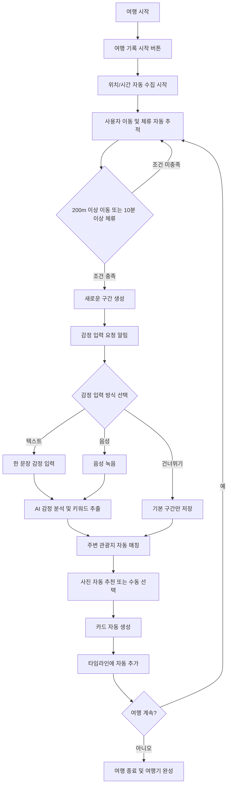
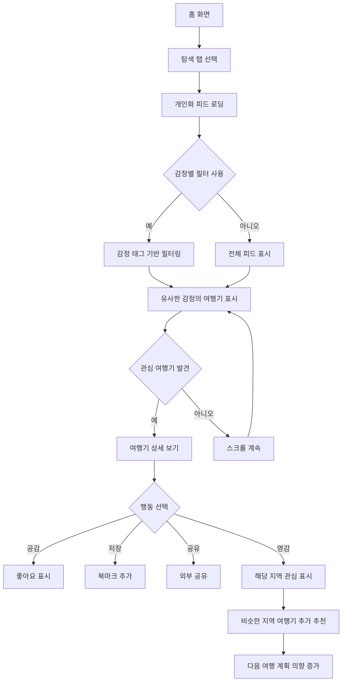
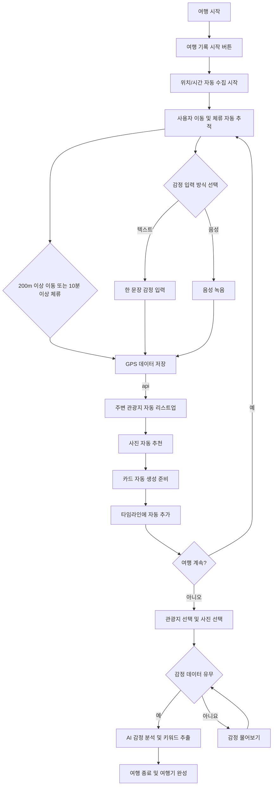

# 사용자 플로우 정의서

<aside>


본 문서는 사용자가 **서비스를 이용하는 전체 여정과 각 단계별 인터랙션을 정의**하여, UX/UI 설계와 개발 가이드를 제공합니다.

</aside>

# 1. 핵심 사용자 여정 맵

---

## 1-1. 전체 사용자 플로우

---

```
앱 인지 → 다운로드 → 온보딩 → 첫 여행 기록 → 여행기 완성 → 탐색 및 영감 → 반복 사용
```

## 1-2. 핵심 기능별 플로우

---

### 1) 감정 기반 자동 기록 플로우 다이어그램



### 2) 여행기 탐색 및 영감 플로우



### 3) 수정안



# 2. 화면별 상세 플로우 다이어그램

---

## 2-1. 온보딩 화면 플로우

---

1. **웰컴 화면**: 서비스 핵심 가치 소개 (3페이지 스와이프)
2. **권한 설정**: 위치, 카메라, 마이크 권한 요청,시리 권한 , 잠금화면 위젯 권한,  (단계별)
3. **간편 가입**: 카카오 로그인 또는 이메일 가입
4. **관심 설정**: 선호하는 여행 스타일 선택 (힐링, 액티브, 문화 등)

## 2-2. 여행 시작 화면 플로우

---

```
메인 화면 → "여행 기록 시작" 큰 버튼 → 현재 위치 확인 → "기록이 시작되었어요" 확인 메시지
```

**화면 구성**

- 상단: 현재 위치 및 날씨 정보 표시
- 중앙: "여행 기록 시작" 메인 버튼
- 하단: 이전 여행기 목록 (최근 3개)

## 2-3. 여행 중 데이터(감정, 음성, 이미지 등) 입력 플로우

---

### 1) 자동 구간 감지 및 알림

---

사용자가 이동하거나 한 곳에 머물면 앱이 자동으로 아래 항목 실행.

1. **조용한 알림**: "새로운 장소에 도착했어요" (진동 + 간단한 푸시)
2. **감정 입력 제안**: "이곳에서의 기분은 어떠세요?"

### 2) 감정 입력 화면 플로우

---

```
플레이스홀더 "지금 기분을 한마디로?" 표시 → 사용자 타이핑 → 실시간 글자 수 표시 (5-100자) 
→ 완료 버튼 활성화
```

```
마이크 아이콘 탭 → "말씀해 주세요" 안내 → 녹음 시작 (파형 표시) → 자동 종료 또는 수동 종료 
→ STT 변환 → 결과 확인 → 수정/완료 선택
```

**화면 구성**

- 상단: 감지된 위치명 표시 (예: "속초해변 근처")
- 중앙: 입력 방식 토글 (텍스트/음성)
- 하단: "나중에 하기", "완료" 버튼

### 3) AI 분석 및 카드 생성 플로우

---

```
입력 완료 → "감정을 분석하고 있어요" 로딩 (3-5초) → "카드를 만들고 있어요" 로딩 (2-3초) 
→ 완성된 카드 미리보기
```

**생성된 카드 구성**

- 배경: 감정에 따른 색상/그라데이션
- 상단: 장소명 + 시간
- 중앙: AI 생성 감정 문장
- 하단: 감정 태그들 (#평화로움, #자유로움)
- 우측: 대표 사진 (선택 시)

## 2-4. 여행기 생성 완료 및 결과물 표시 플로우

---

```
"여행 기록 종료" 버튼 → 전체 여행 요약 표시 → "여행기 제목" 입력 옵션 → 공개 설정 선택 
→ 완성 확인
```

```
카드 탭 → 전체 화면으로 확장 
→ 상세 정보 표시 (사진 여러 장, 전체 감정 문장, 체류 시간, 지도 위치)
```

**여행기 타임라인 화면 구성**

- 상단: 여행 제목, 기간, 총 이동거리
- 중앙: 시간순 카드 나열 (세로 스크롤)
- 각 카드: 탭하면 상세 보기로 확장
- 하단: "공유하기", "편집하기" 버튼

## 2-5. 탐색 및 피드 사용 플로우

---

```
피드에서 카드 탭 → 슬라이드 업 애니메이션 → 전체 여행기 표시 → 스크롤로 전체 여정 확인 
→ 하단에 반응 버튼들
```

1. **화면 구성**
    - 상단: 필터 버튼 (지역, 감정, 테마)
    - 중앙: 추천 여행기 카드 (무한 스크롤)
    - 우하단: 빠른 기록 FAB
2. **개인화 알고리즘 반영**
    - 사용자가 자주 표현하는 감정과 유사한 콘텐츠 우선 노출
    - 최근 방문한 지역과 관련된 콘텐츠 추천
    - 공감(좋아요)한 여행기와 유사한 스타일 추천

# 3. 카드 생성 및 자동화 과정 상세 정의

---

## 3-1. 카드 생성의 정확한 조건 및 타이밍

---

> **기본 원칙 : 카드는 자동 생성 & 자동 정리**
> 

사용자는 단지

- **"여행 시작" 버튼 누르고**
- **감정 한 마디 남기고**
- **사진 몇 장 업로드하거나 찍기만** 하면

시스템이 알아서

- 위치 이동/체류 → 일정 구간 구분
- 감정 기록/사진 업로드 발생 → 카드 내용 채우기
- 일정 종료 → 자동으로 **카드가 생성**되어 타임라인에 올라감

### **1) 카드 자동 생성 조건**

---

> 최적 조건 : **이미지 + 감상평 + 위치 적합성**
> 
- **필수 요소** : 위치 정보 (GPS 또는 수동 선택)
- **선택 요소** : 감정 입력, 사진, 체류 시간
- **최소 조건** : 위치 + 시간만으로도 기본 카드 생성 가능

### **2) 자동 업로드 타이밍 결정**

---

| 조건 | 타이밍 | 처리 방식 |
| --- | --- | --- |
| 구간 완료 시 | 200m 이상 이동 또는 다음 장소 도착 | 즉시 카드 생성 |
| 감정 입력 시 | 감정 입력 완료 후 3초 | AI 분석 후 카드 업데이트 |
| 사진 추가 시 | 사진 선택/촬영 완료 후 | 해당 구간 카드에 자동 연결 |
| 여행 종료 시 | "여행 기록 종료" 버튼 클릭 | 미완성 구간도 강제 카드 생성 |

## 3-2. 사진 연동 상세 플로우

---

### **1) 사진 자동 추천 로직**

```
사진 촬영 감지 → EXIF 시간 정보 확인 → 현재 구간과 시간 매칭 → "이 사진을 추가할까요?" 제안
```

### **2) 사진 연동 옵션**

- **자동 추천**: "최근 1시간 내 찍은 사진이 있어요"
- **수동 선택**: 갤러리에서 직접 선택
- **실시간 촬영**: 앱 내에서 바로 촬영
- **EXIF 활용**: 사진의 위치 정보는 활용하되, 실제 좌표는 저장하지 않음

## 3-3. 일정 자동 분할 기준 상세

---

### **1) 구간 분할 알고리즘**

1. **거리 기반**: 사용자가 200m 이상 이동
2. **시간 기반**: 한 장소에 10분 이상 체류
3. **행동 기반**: 감정 입력, 사진 촬영 등 능동적 행위
4. **장소 기반**: TourAPI 기반 관광지 경계 인식

### **2) 구간 분할 예시**

---

```
🚗 이동 감지 (속초역 → 속초해변)
📍 도착 인식 (속초해변 근처)
⏰ 체류 시작 (10:00)
📝 감정 입력 ("바다가 시원해")
📷 사진 촬영 (해변 풍경)
⏰ 체류 종료 (10:30, 30분간 머물음)
🚗 다음 이동 감지 → 카드 확정 생성
```

## 3-4. 수동 편집 기능 상세

---

### **1) 편집 가능한 요소**

- **카드 제목**: AI 생성 제목 수정
- **감정 태그**: 태그 추가/삭제/수정
- **대표 사진**: 다른 사진으로 교체
- **감정 문장**: AI 생성 문장 수정
- **시간 조정**: 시작/종료 시간 수동 조정

### **2) 고급 편집 기능**

- **카드 병합**: 연속된 구간을 하나로 합치기
- **카드 분할**: 긴 구간을 여러 카드로 나누기
- **카드 삭제**: 불필요한 구간 제거
- **순서 조정**: 카드 순서 수동 변경

# 4. 예상되는 예외 상황 처리 플로우

---

## 4-1. 기술적 오류 상황

---

### **1) GPS 신호 불량**

```
위치 수집 실패 → "위치를 찾고 있어요" 메시지 (5초) → 여전히 실패 시 "수동으로 위치를 선택해 주세요" → 주요 관광지 목록 제공 → 사용자 선택
```

### **2) 네트워크 연결 불안정**

```
AI 분석 요청 실패 → "연결 상태를 확인하고 있어요" (3초 재시도) → 계속 실패 시 → "잠시 후 다시 시도해 주세요" → 임시 저장 후 네트워크 복구 시 자동 재처리
```

### **3) 음성 인식 실패**

```
STT 변환 실패 → "잘 들리지 않았어요" → "다시 말씀해 주세요" 버튼 → 3회 실패 시 → "텍스트로 입력해 주세요" 대안 제공
```

## 4-2. 사용자 행동 예외

---

### **1) 감정 입력 거부**

```
감정 입력 알림 → "나중에 하기" 선택 → 해당 구간은 위치와 시간만으로 기본 카드 생성 → 나중에 "감정 추가하기" 옵션 제공
```

### **2) 부적절한 내용 입력**

```
비속어/혐오 표현 감지 → "적절한 내용을 입력해 주세요" 안내 → 재입력 요청 → 3회 반복 시 해당 입력 건너뛰기
```

### **3) 동일 장소 재방문**

```
이전에 기록한 장소 재감지 → "이전에 기록한 장소네요" 알림 → "새로운 감정으로 추가 기록할까요?" 옵션 → 선택에 따라 새 카드 생성 또는 기존 카드에 추가
```

## 4-3. 데이터 처리 예외

---

### **1) 사진 없는 구간**

```
감정 입력만 있고 사진 없음 → 기본 일러스트 또는 그라데이션 배경으로 카드 생성 → "사진 추가하기" 옵션 제공
```

### **2) 매우 짧은 체류시간**

```
3분 이하 체류 → "잠깐 들른 곳이네요" → 별도 카드 생성하지 않고 이동 경로에만 표시 → 사용자가 원할 경우 수동으로 카드 생성 가능
```

# 5. 인터랙션 및 애니메이션 상세 정의

---

## 5-1. 핵심 마이크로 인터랙션

---

### **1) 여행 시작 버튼**

- **Idle 상태**: 부드러운 펄스 애니메이션 (1.5초 주기)
- **탭 시**: 0.1초 스케일 다운 → 0.2초 스케일 업 + 색상 변화
- **활성화 후**: "기록 시작됨" 체크마크 애니메이션

### **2) 감정 입력 완료**

- **텍스트 입력**: 타이핑 완료 시 입력창 테두리 색상 변화
- **음성 입력**: 녹음 중 파형 애니메이션 → 완료 시 체크 표시
- **AI 분석 중**: 감정을 상징하는 컬러 그라데이션 로딩 (3-5초)

### **3) 카드 생성 완료**

- **등장**: 하단에서 슬라이드 업 + 페이드 인 (0.5초)
- **성공 피드백**: 부드러운 바운스 + 성공 사운드
- **저장**: 카드가 타임라인으로 이동하는 애니메이션

## 5-2. 페이지 전환 애니메이션

---

### **1) 화면 간 이동**

- **탭 전환**: 0.3초 페이드 전환
- **여행기 상세**: 카드에서 전체 화면으로 확장 애니메이션 (0.4초)
- **뒤로가기**: 오른쪽 스와이프 제스처 지원

### **2) 상태 변화 표시**

- **로딩 상태**: 스켈레톤 UI 활용
- **오류 상태**: 부드러운 흔들림 애니메이션 + 빨간색 강조
- **성공 상태**: 녹색 체크마크 + 확산 효과

## 5-3. 피드백 및 가이드

---

### **1) 사용자 가이드**

- **온보딩**: 각 단계별 툴팁과 하이라이트
- **첫 기록**: "여기를 눌러 감정을 남겨보세요" 애니메이션 가이드
- **첫 완성**: "첫 여행기가 완성되었어요!" 축하 애니메이션

### **2) 지속적 피드백**

- **햅틱 피드백**: 중요한 액션에서 진동 제공
- **사운드 피드백**: 성공/실패 시 적절한 효과음
- **시각적 피드백**: 모든 터치에 즉시 반응