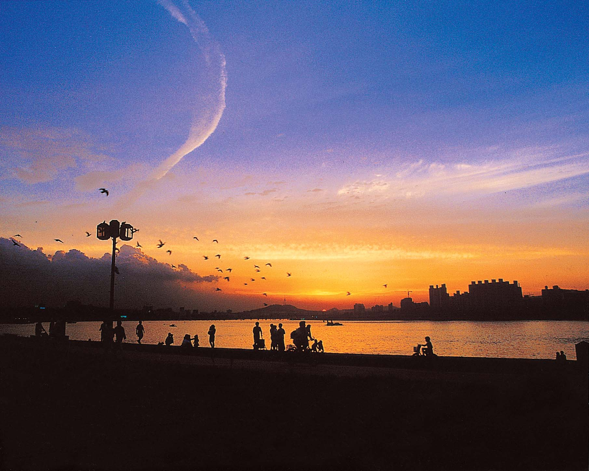

# TAG

---

| 범주 | 설명 | 예시 |
| --- | --- | --- |
| 🧠 **감정·심리** | 여행 중 느낀 감정, 심리상태 중심 | `#설렘` `#고요함` `#그리움` `#행복` `#쓸쓸함` `#위로` `#따뜻함` `#벅참` `#해방감` `#집중` |
| 🌅 **자연·풍경 분위기** | 날씨, 자연, 공간이 주는 인상 | `#햇살` `#노을` `#파도소리` `#안개` `#쨍한날` `#밤하늘` `#달빛` `#비오는날` `#청명함` `#은은함` |
| 🗺️ **지형·장소 특성** | 물리적 위치나 환경 정보 중심 | `#해변` `#산책로` `#한옥마을` `#골목길` `#전통시장` `#전망대` `#공원` `#숲속` `#섬` `#호수` |
| 📆 **시간대·계절** | 여행한 시점 기반 묘사 | `#봄꽃` `#여름밤` `#가을단풍` `#겨울바다` `#새벽산책` `#이른아침` `#한낮` `#해질녘` `#밤산책` `#첫눈` |
| 👥 **동반자 관계** | 누구와 함께했는지에 대한 맥락 | `#혼자여행` `#커플여행` `#가족여행` `#아이들과함께` `#부모님과함께` `#친구들과` `#단체여행` |
| 🧭 **여행 목적·성격** | 어떤 유형/목적으로 떠난 여행인지 | `#힐링여행` `#맛집투어` `#사진여행` `#도보여행` `#자연치유` `#성지순례` `#체험여행` `#역사탐방` `#쉼여행` |
| 🧳 **활동·체험 요소** | 실제로 한 행동이나 활동 중심 | `#산책` `#카페탐방` `#맛집탐방` `#수영` `#등산` `#시장구경` `#자전거` `#일몰감상` `#명상` `#책읽기` |
| 🎨 **감성 스타일** | 콘텐츠 톤/무드/비주얼 스타일 | `#필름감성` `#따뜻한톤` `#차분한톤` `#레트로` `#몽환적` `#빈티지풍` `#미니멀` `#컬러풀` `#로컬감성` `#네이처무드` |
| 🔖 **콘텐츠 구조·형식** | 여행기를 구성하는 콘텐츠 포맷 중심 (확장용) | `#1일1기록` `#사진중심` `#텍스트중심` `#스냅기록` `#타임라인형` `#앨범형` |
| 🧬 **개인성·메타 태그** | 사용자 특성 또는 상황 기반 (추천용 필드) | `#첫여행` `#재방문` `#기념일여행` `#즉흥여행` `#휴식필요` `#기획여행` |

*더 추가하고 싶은 범주 및 태그 상의하고 넣기 .* 

*해당 태그들을 분류하기 위해서 필요한 데이터 생각해보자 .* 

*⇒ AI가 태깅하기 힘든 태그지만 사용자가 넣고 싶을 때를 고려해봤을 때, 시스템 사용자가 태그를 수정할 수 있는 형태면 좋을 것 같다.*  

# ~~여기여기여기여기여기여기여기여기여기여기~~

| 태그 유형 | 필요 데이터 | 예시 입력 | 활용 방식 |
| --- | --- | --- | --- |
| **감정** | 사용자가 작성한 감성 문장 (ex. "바람이 시원하다") | `"아이들과 걷는 이 길이 행복하다"` | 감정 키워드 추출 → 감성 분류 모델(BERT+감정 라벨링 등) |
| **장소 특성**  | 위치 좌표, 근처 관광지 정보 (TourAPI, Kakao Map) | `N37.123, E127.456` → "속초해변" | 장소명 매핑 + 지역별 특성 기반 장소 태그 |
| **활동** | 사용자 행동 패턴, 체류 시간, 거리 이동 패턴, 사진 찍은 시간 | 1. 30분 체류, 2. 위치 정체됨, 3. 사진 3장 촬영 | 이동/정지 판단 → 활동 예측 (ex. 산책) |
| **시간대/계절**  | 기록 시점의 시간/날짜, 기상청 API | 2025-06-04 18:32, 흐림 | 노을 시간 매핑, 계절 기반 키워드 생성 |
| **관계**  | 사용자의 프로필 정보, 여행 기록 수, 동행자 수 (선택 or 로그 분석) | 여행 중 '나만' 기록 있음 | 연관 사용자 수, 같은 travel_id 기반 관계 추론 |
| **콘텐츠 스타일**  | 카드에 포함된 입력 길이, 이미지 포함 여부 | 입력 40자, 사진 있음 | 콘텐츠 구성 분석 → 유형 분류 |
| **톤/분위기**  | 이미지 색상 분포, 단어 감성 톤, 날씨 정보 | 사진 내 밝은 톤, 맑음, 감성 표현 | 이미지 분석(CV) + 문장 톤 조합 |
| **여행 방식**  | 기록 주기, 여행 시작 시점부터 카드 간 간격 | 3시간 간격 비정기 기록 | 일정 계획 유무 추론 (패턴 분석) |

*⇒ 이미지 넣고, 태깅 해봄 . not bad .*

`#노을 #해질녘 #강변 #산책 #가족과함께 #고요함 #따뜻한톤 #실루엣 #필름감성 #감성수집가`